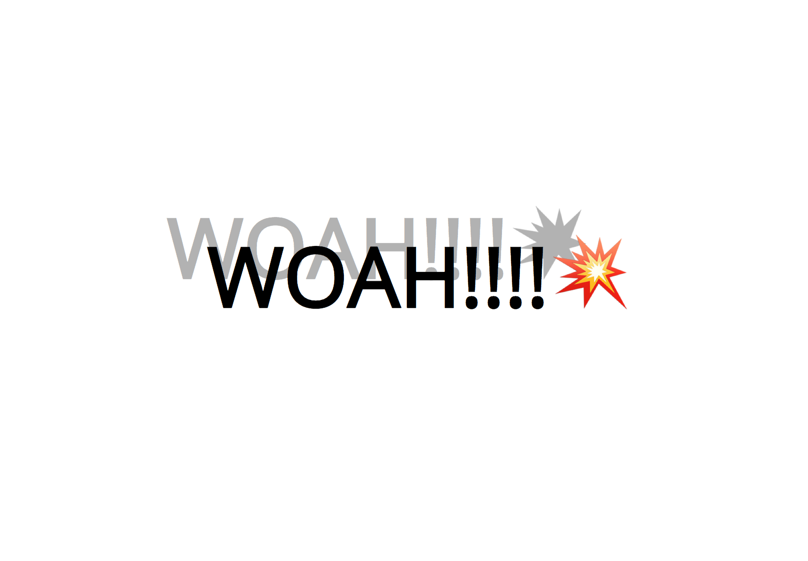
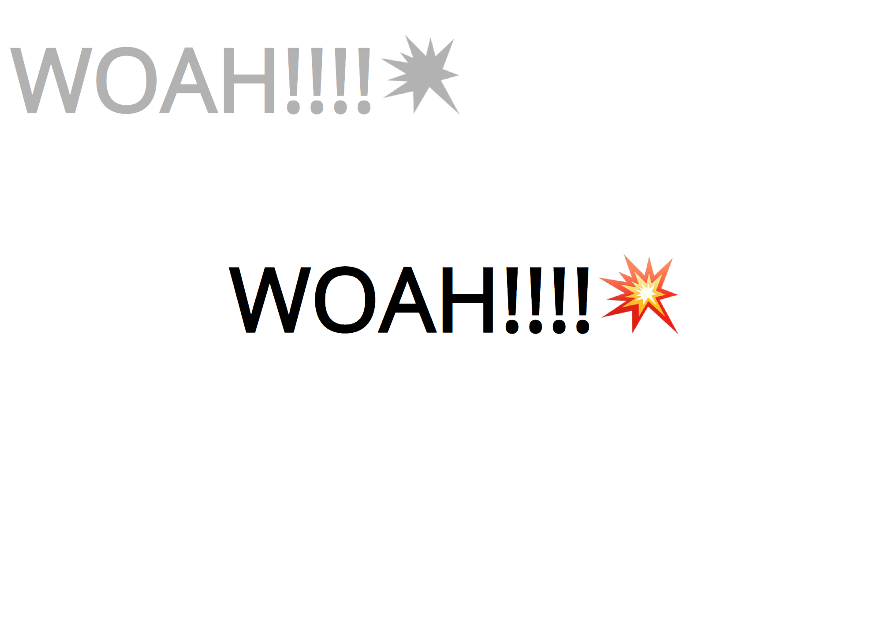
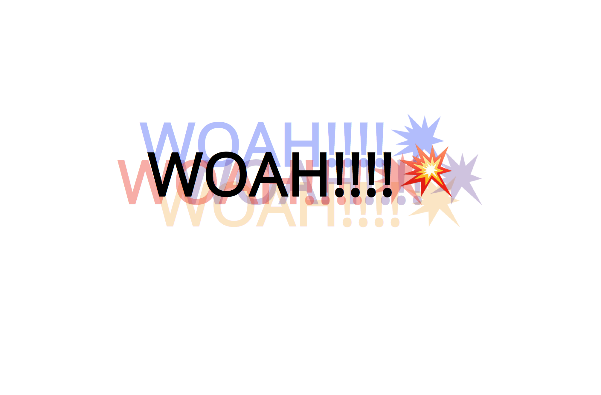

# 16. Mouse Over Shadow

#### _Mouse Over Shadow by JavaScript30 10/18/19_

## Description
This is Mouse Over Shadow, 16th application out of 30 by 30 day Vanilla JavaScript Coding Challenge by Wes Bos.<br>
Please check the challenge from [JavaScript30](http://wesbos.com/javascript30/).




## About this Application:
- Text shadow will follow your mouse move.
- You can change how far the shadow goes. Change the value of `walk` in line 4 of `mina.js`. The bigger the number gets, the farther the shadow goes.


- Multiple shadow effect - comment out the line 22 and uncomment the line 25 - 30 to play around.


- This application helps to understand the difference between `event.currentTarget` and `event.target`.

## Setup/Installation

1. Clone this repo:
```
$ git clone https://github.com/misakimichy/JS30-16-mouse-over-shadow.git
```

2. Navigate to the top level of the cloned directory.

3. Open `index.html` with your preferred web browser.

## Known Bugs
* No known bugs at this time.

## Support and contact details
 I welcome any feedbacks and comments: misaki.koonce@gmail.com

## Technologies Used
_Git, GitHub, HTML, CSS, Vanilla JavaScript

## License
Copyright © 2019 under the MIT License